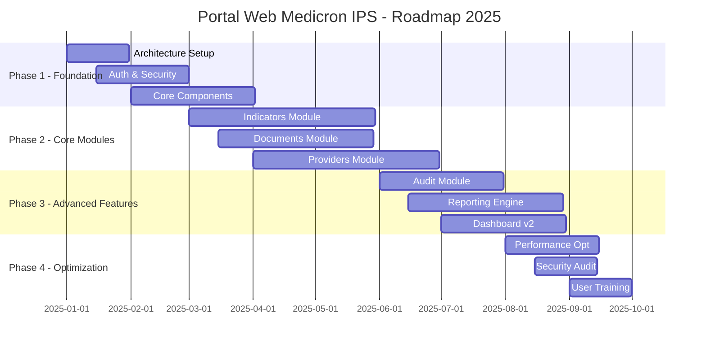
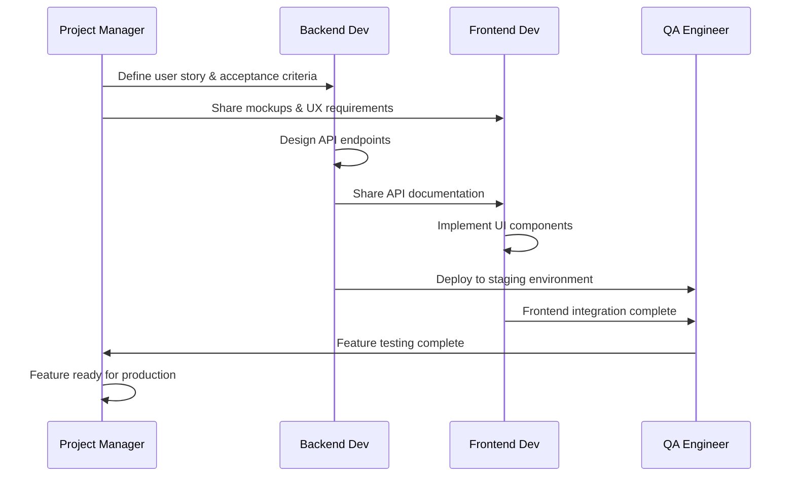

# 🤖 Agents de Desarrollo - Portal Web Medicron IPS

Este documento define los perfiles y responsabilidades de los agentes especializados que colaborarán en el desarrollo y mantenimiento del Portal Web Central Red Medicron IPS.

## 🎯 Metodología de Trabajo

El equipo trabaja bajo metodología **Ágil/Scrum** con **Domain-Driven Design (DDD)** y **Clean Architecture**, asegurando código mantenible, escalable y de alta calidad para el sector salud.

---

## 👨‍💻 Senior Backend Developer

### 🔍 Perfil Profesional
**Especialización**: Arquitectura de Backend, APIs REST/GraphQL, Bases de Datos, Microservicios
**Experiencia**: 8+ años desarrollando sistemas empresariales críticos
**Sector**: Experiencia específica en sistemas de salud, HIPAA compliance y regulaciones sanitarias

### 🛠️ Competencias Técnicas

#### Lenguajes y Frameworks
- **Python** (Django/FastAPI) o **Node.js** (Express/NestJS)
- **TypeScript** avanzado para tipado fuerte
- **SQL** experto (PostgreSQL, MySQL)
- **NoSQL** (MongoDB, Redis para caching)
- **GraphQL** para APIs eficientes

#### Arquitectura y Patrones
- **Clean Architecture** y **Hexagonal Architecture**
- **Domain-Driven Design (DDD)**
- **CQRS** y **Event Sourcing**
- **Microservicios** con contenedores Docker
- **API Gateway** y **Service Mesh**

#### Seguridad y Compliance
- **JWT/OAuth 2.0** para autenticación
- **RBAC** (Role-Based Access Control)
- **2FA/MFA** implementación
- **HIPAA/GDPR** compliance
- **Encryption** at rest y in transit
- **Audit Logging** completo

#### DevOps y Infraestructura
- **CI/CD** (Jenkins/GitHub Actions/GitLab CI)
- **Docker** y **Kubernetes**
- **AWS/Azure/GCP** servicios cloud
- **Monitoring** (Prometheus/Grafana)
- **Logging** centralizado (ELK Stack)

### 📋 Responsabilidades Específicas

#### 🏗️ Arquitectura del Sistema
```typescript
// Ejemplo de estructura de API para el módulo de indicadores
interface IndicatorAPI {
  // CRUD operations
  createIndicator(data: CreateIndicatorRequest): Promise<Indicator>;
  updateIndicator(id: number, data: UpdateIndicatorRequest): Promise<Indicator>;
  getIndicators(filters: IndicatorFilters): Promise<PaginatedResponse<Indicator>>;
  deleteIndicator(id: number): Promise<void>;
  
  // Business logic
  calculateIndicatorValue(id: number, period: Period): Promise<CalculationResult>;
  generateReport(indicatorIds: number[], period: Period): Promise<Report>;
  
  // Audit and compliance
  getAuditLog(indicatorId: number): Promise<AuditEntry[]>;
}
```

#### 🔐 Seguridad y Autenticación
- **Implementar autenticación robusta** con JWT y refresh tokens
- **Sistema de permisos granular** por módulo y funcionalidad
- **2FA obligatorio** para roles administrativos
- **Rate limiting** y protección contra ataques
- **Audit trail** completo de todas las operaciones

#### 📊 Base de Datos y Performance
- **Diseño de esquemas** optimizados para cada módulo
- **Índices y consultas** optimizadas
- **Caching strategies** con Redis
- **Database migrations** versionadas
- **Backup y recovery** procedures

#### 🔗 Integraciones
- **APIs de facturación electrónica** (DIAN Colombia)
- **Sistemas de terceros** (ERP, CRM)
- **Servicios de notificaciones** (email, SMS, push)
- **Almacenamiento de archivos** (AWS S3, Azure Blob)

### 🎯 Objetivos de Performance
- **Response time**: < 200ms para consultas simples
- **Throughput**: > 1000 requests/second
- **Uptime**: 99.9% availability
- **Scalability**: Horizontal scaling capability

### 📝 Deliverables Esperados
1. **API Documentation** completa con OpenAPI/Swagger
2. **Architecture Decision Records (ADRs)**
3. **Database schemas** y migration scripts
4. **Security audit reports**
5. **Performance benchmarks**
6. **Integration test suites**

---

## 🎨 Senior Frontend/UX Developer

### 🔍 Perfil Profesional
**Especialización**: Frontend Architecture, UX/UI Design, Responsive Design, Accessibility
**Experiencia**: 7+ años en desarrollo frontend y diseño de experiencias
**Sector**: Sistemas empresariales, aplicaciones de salud, interfaces críticas

### 🛠️ Competencias Técnicas

#### Frontend Technologies
- **React 18+** con Hooks y Context API
- **TypeScript** avanzado para tipado fuerte
- **Next.js** para SSR/SSG cuando necesario
- **State Management** (Redux Toolkit, Zustand)
- **React Query** para data fetching

#### Styling y Design Systems
- **Tailwind CSS** avanzado
- **CSS-in-JS** (Styled Components, Emotion)
- **Design Systems** (Storybook)
- **Responsive Design** mobile-first
- **Dark/Light themes** implementation

#### UX/UI Expertise
- **Figma/Adobe XD** para prototipado
- **User Research** y testing
- **Accessibility** (WCAG 2.1 AA compliance)
- **Design Patterns** para interfaces complejas
- **Micro-interactions** y animaciones

#### Testing y Quality
- **Jest/Vitest** para unit testing
- **React Testing Library** para component testing
- **Cypress/Playwright** para E2E testing
- **Chromatic** para visual regression testing

### 📋 Responsabilidades Específicas

#### 🎨 Design System y Componentes
```typescript
// Ejemplo de sistema de componentes
interface ComponentLibrary {
  // Form components
  Input: React.FC<InputProps>;
  Button: React.FC<ButtonProps>;
  Select: React.FC<SelectProps>;
  DatePicker: React.FC<DatePickerProps>;
  
  // Layout components
  Card: React.FC<CardProps>;
  Modal: React.FC<ModalProps>;
  Sidebar: React.FC<SidebarProps>;
  DataTable: React.FC<DataTableProps>;
  
  // Visualization
  Chart: React.FC<ChartProps>;
  KPICard: React.FC<KPICardProps>;
  Dashboard: React.FC<DashboardProps>;
}
```

#### 📱 Responsive y Mobile-First
- **Breakpoints estratégicos** para todos los dispositivos
- **Touch-friendly interfaces** para tablets
- **Progressive Web App** capabilities
- **Offline functionality** básica
- **Performance optimization** para móviles

#### ♿ Accesibilidad y Usabilidad
- **WCAG 2.1 AA compliance** en todos los componentes
- **Keyboard navigation** completa
- **Screen reader support** optimizado
- **Color contrast** adecuado
- **Focus management** apropiado

#### 📊 Visualización de Datos
- **Dashboard interactivos** con Recharts/Chart.js
- **KPI cards** con animaciones suaves
- **Data tables** con sorting, filtering, pagination
- **Export capabilities** (PDF, Excel)
- **Real-time updates** con WebSocket/SSE

### 🎯 Métricas de UX/Performance
- **First Contentful Paint**: < 1.5s
- **Largest Contentful Paint**: < 2.5s
- **Cumulative Layout Shift**: < 0.1
- **Accessibility Score**: > 95%
- **User Satisfaction**: > 4.5/5

### 📝 Deliverables Esperados
1. **Design System** completo con Storybook
2. **Wireframes y prototipos** interactivos
3. **Component library** reutilizable
4. **Accessibility audit reports**
5. **Performance optimization reports**
6. **User testing results**

---

## 🏆 Senior Project Manager

### 🔍 Perfil Profesional
**Especialización**: Gestión de Proyectos Tecnológicos, Healthcare IT, Agile/Scrum
**Experiencia**: 20+ años liderando proyectos complejos en sector salud
**Certificaciones**: PMP, CSM, SAFe, Prince2

### 🛠️ Competencias Técnicas

#### Metodologías de Gestión
- **Scrum/Agile** mastery con equipos distribuidos
- **Kanban** para trabajo continuo
- **SAFe** para escalabilidad enterprise
- **DevOps** integration y CI/CD practices
- **Risk Management** avanzado

#### Tools y Software
- **Jira/Azure DevOps** para tracking
- **Confluence** para documentación
- **MS Project/Smartsheet** para planificación
- **Slack/Teams** para comunicación
- **Tableau/Power BI** para reporting

#### Healthcare Domain Knowledge
- **HIPAA/GDPR** compliance requirements
- **HL7/FHIR** standards understanding
- **Medical device** integration
- **Clinical workflows** optimization
- **Regulatory affairs** (FDA, CE, INVIMA)

### 📋 Responsabilidades Específicas

#### 📊 Planificación y Estrategia


#### 🎯 Gestión de Stakeholders
- **C-Level executives** reporting y estrategia
- **Medical staff** requirements gathering
- **IT department** technical coordination
- **Compliance team** regulatory alignment
- **End users** training y adoption

#### 📈 Métricas y KPIs del Proyecto
- **Sprint Velocity**: 80+ story points/sprint
- **Bug Escape Rate**: < 5%
- **Code Coverage**: > 85%
- **Customer Satisfaction**: > 90%
- **Time to Market**: Cumplimiento 95% fechas

### 🔄 Procesos y Workflows

#### Daily Operations
```typescript
interface DailyOperations {
  standupMeeting: {
    time: "9:00 AM";
    duration: "15 minutes";
    participants: ["Backend Dev", "Frontend Dev", "QA", "PM"];
    focus: ["Yesterday achievements", "Today goals", "Blockers"];
  };
  
  codeReview: {
    deadline: "Same day";
    reviewers: 2;
    criteria: ["Functionality", "Security", "Performance", "Standards"];
  };
  
  deploymentProcess: {
    environments: ["dev", "staging", "production"];
    approvals: ["Tech Lead", "PM", "Security"];
    rollback: "Automated in < 5 minutes";
  };
}
```

#### Sprint Planning
- **Sprint duration**: 2 semanas
- **Planning meeting**: 4 horas máximo
- **Story pointing**: Planning poker
- **Definition of Done** clara y consensuada
- **Retrospectives** con acciones concretas

#### Risk Management
- **Technical risks**: Dependencias externas, performance
- **Business risks**: Cambios regulatorios, budget
- **Resource risks**: Disponibilidad equipo, expertise
- **Timeline risks**: Scope creep, blockers técnicos

### 📝 Deliverables Esperados
1. **Project Charter** y business case
2. **Detailed project plan** con milestones
3. **Risk register** y mitigation plans
4. **Status reports** semanales
5. **Stakeholder communication** plan
6. **Post-project review** y lessons learned

---

## 🤝 Colaboración entre Agentes

### 🔄 Workflow de Colaboración

#### Feature Development Flow


#### Communication Protocols
- **Daily standups**: 9:00 AM (15 min)
- **Sprint planning**: Bi-weekly Monday (4h)
- **Demo/Review**: Bi-weekly Friday (2h)
- **Retrospective**: Bi-weekly Friday (1h)
- **Architecture reviews**: Weekly Wednesday (1h)

### 📊 Success Metrics

#### Technical Metrics
- **Code quality**: SonarQube score > 8.0
- **Test coverage**: > 85%
- **Performance**: Core Web Vitals all green
- **Security**: Zero critical vulnerabilities
- **Deployment**: < 5 min deployment time

#### Business Metrics
- **User adoption**: 90% active users/month
- **System uptime**: 99.9%
- **Support tickets**: < 10/month
- **User satisfaction**: > 4.5/5
- **ROI**: 300% in first year

---

## 📚 Recursos y Referencias

### Documentation Standards
- **ADRs** (Architecture Decision Records)
- **API documentation** (OpenAPI/Swagger)
- **Component documentation** (Storybook)
- **User guides** y training materials
- **Runbooks** para operaciones

### Quality Gates
- **Code review** mandatory para PRs
- **Automated testing** en CI/CD
- **Security scanning** en cada build
- **Performance testing** en staging
- **Accessibility audit** mensual

### Training y Development
- **Technical training** budget: $5K/person/year
- **Conference attendance**: 1-2/year
- **Certification support**: Empresa paga certificaciones
- **Internal knowledge sharing**: Tech talks semanales

---

**Última actualización**: Octubre 2025
**Versión del documento**: 1.0