# 🏗️ Arquitectura del Sistema - portal web para empresas que requieren un control detallado de sus operaciones comerciales y administrativas

## 📋 Índice
1. [Visión General](#-visión-general)
2. [Arquitectura de Alto Nivel](#-arquitectura-de-alto-nivel)
3. [Arquitectura Frontend](#-arquitectura-frontend)
4. [Arquitectura Backend](#-arquitectura-backend)
5. [Arquitectura de Datos](#-arquitectura-de-datos)
6. [Flujos de Datos](#-flujos-de-datos)
7. [Seguridad](#-seguridad)
8. [Despliegue](#-despliegue)
9. [Escalabilidad](#-escalabilidad)

---

## 🌟 Visión General

El portal web comercial está diseñado con **Clean Architecture** y **Domain-Driven Design (DDD)**, proporcionando una separación clara de responsabilidades y alta mantenibilidad. El sistema está organizado en módulos de dominio independientes que pueden evolucionar de forma autónoma. Este documento describe la arquitectura técnica y operativa pensada para una solución comercial enfocada en trazabilidad y control operativo.

## 📚 Documentación de la API

La API del backend está documentada utilizando OpenAPI/Swagger. Para la especificación completa (endpoints, esquemas y ejemplos) consulta `openapi_documentation.md` en la raíz del repositorio. Esta documentación cubre autenticación, usuarios, empresas, indicadores, facturación y otros recursos clave.

### Principios Arquitectónicos
- **Separation of Concerns**: Cada capa tiene responsabilidades específicas
- **Dependency Inversion**: Las dependencias apuntan hacia el dominio
- **Single Responsibility**: Cada módulo tiene una responsabilidad única
- **Open/Closed Principle**: Extensible sin modificar código existente
- **Interface Segregation**: Interfaces específicas y cohesivas

---

## 🏛️ Arquitectura de Alto Nivel

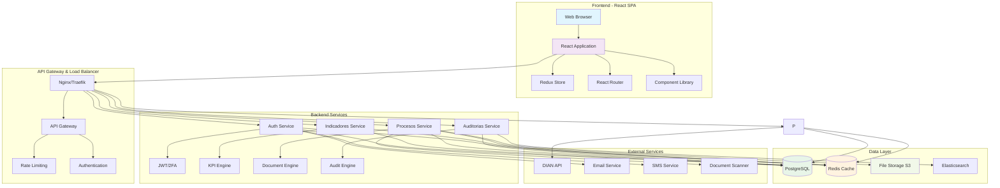

---

## 🎨 Arquitectura Frontend

### Estructura de Capas Frontend

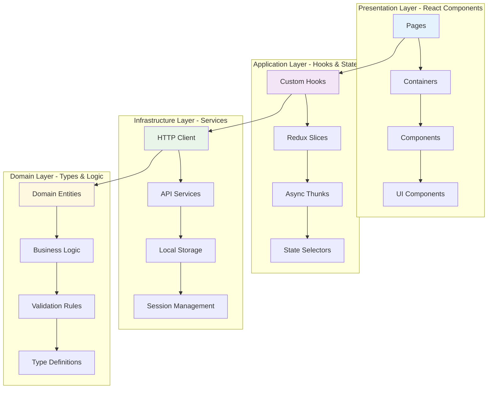

### Módulos Frontend por Dominio

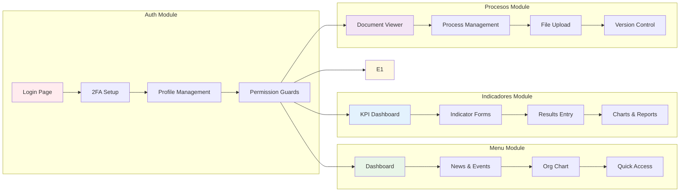

### Estado Global con Redux

```mermaid
graph TB
    subgraph "Redux Store Structure"
        A[Root State] --> B[Auth Slice]
        A --> C[UI Slice]
        A --> D[Indicadores Slice]
        A --> E[Procesos Slice]
        
        B --> B1[user: User | null]
        B --> B2[token: string | null]
        B --> B3[permissions: Permission[]]
        
        C --> C1[theme: 'light' | 'dark']
        C --> C2[sidebar: boolean]
        C --> C3[loading: LoadingState]
        
        D --> D1[indicators: Indicator[]]
        D --> D2[results: Result[]]
        D --> D3[filters: FilterState]
        
        E --> E1[documents: Document[]]
        E --> E2[processes: Process[]]
        E --> E3[uploadState: UploadState]
        
        F --> F1[suppliers: Supplier[]]
        F --> F2[invoices: Invoice[]]
        F --> F3[payments: Payment[]]
    end
    
    style A fill:#e1f5fe
    style B fill:#ffebee
    style C fill:#e8f5e8
    style D fill:#e3f2fd
    style E fill:#f3e5f5
    style F fill:#fff8e1
```

---

## ⚙️ Arquitectura Backend

### Estructura Clean Architecture

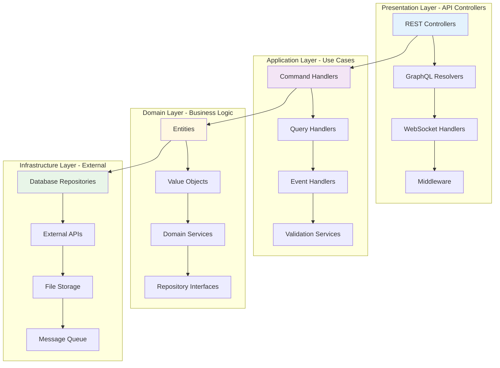

### Microservicios por Dominio

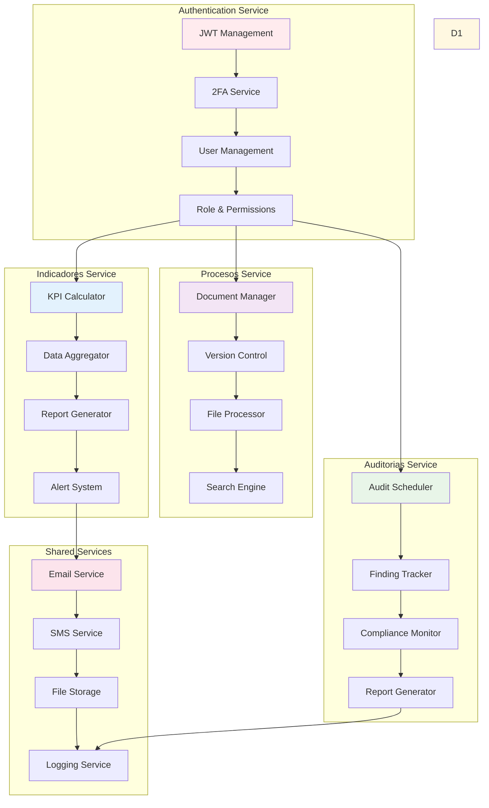

---

## 💾 Arquitectura de Datos

### Modelo de Datos Principal

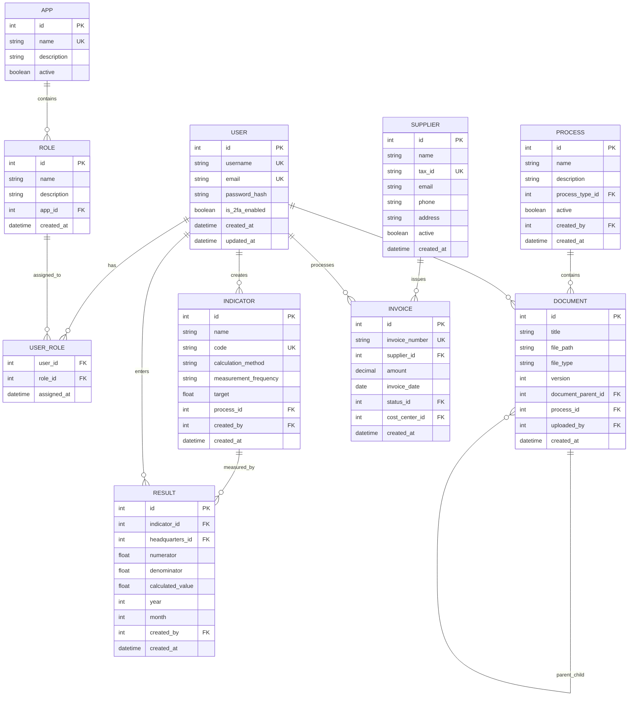

### Estrategia de Caching

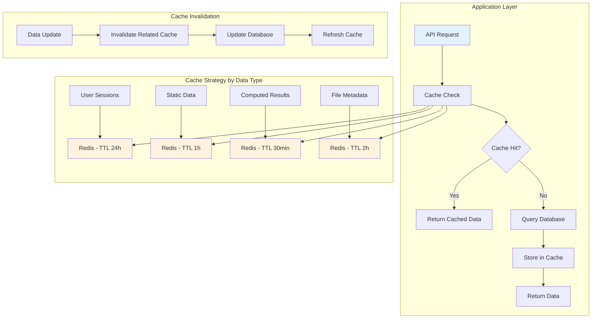

---

## 🔄 Flujos de Datos

### Flujo de Autenticación

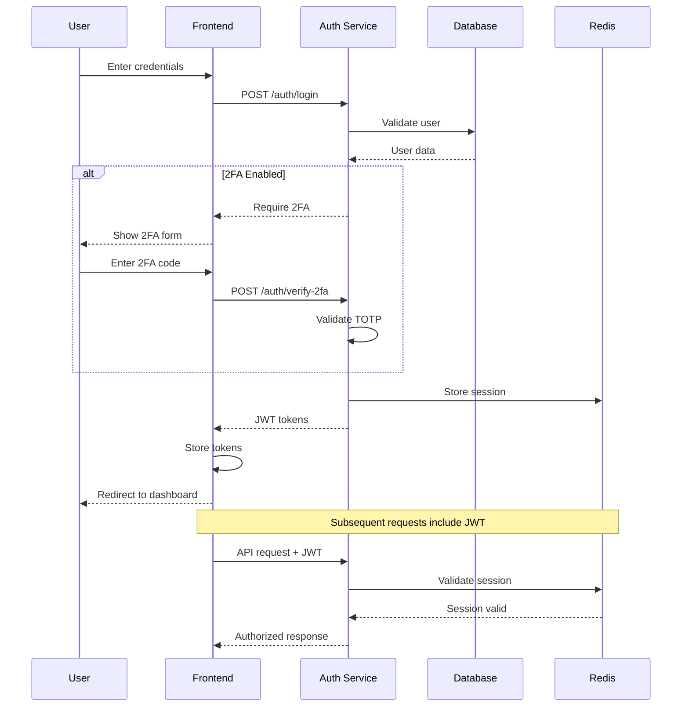

### Flujo de Gestión de Indicadores

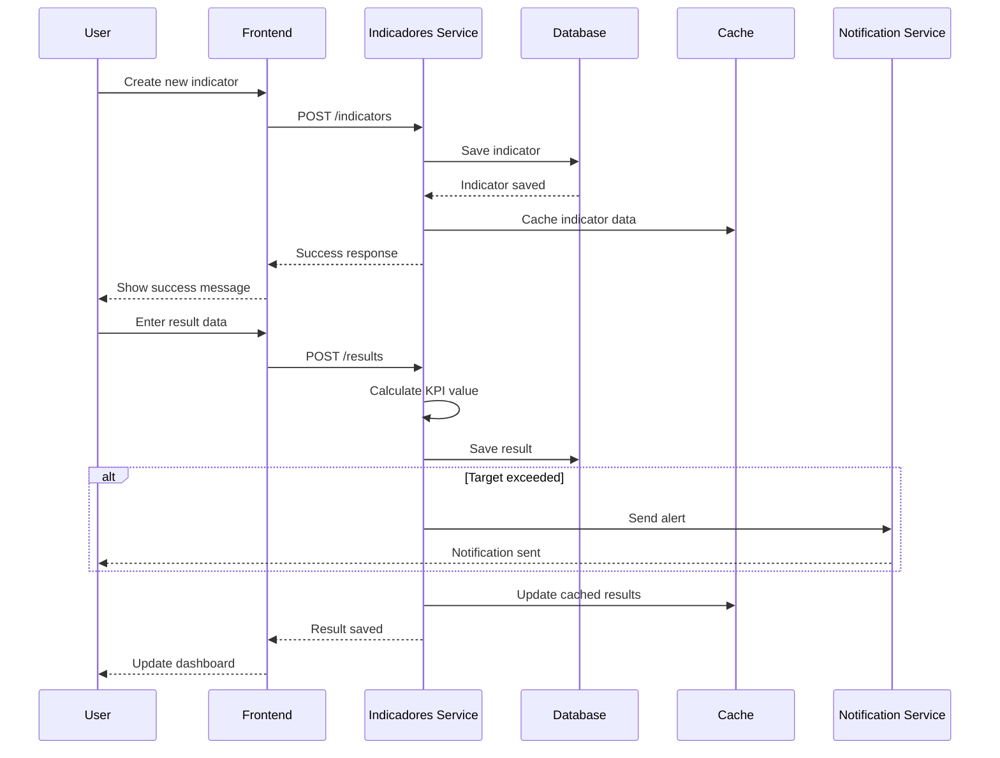

### Flujo de Gestión Documental

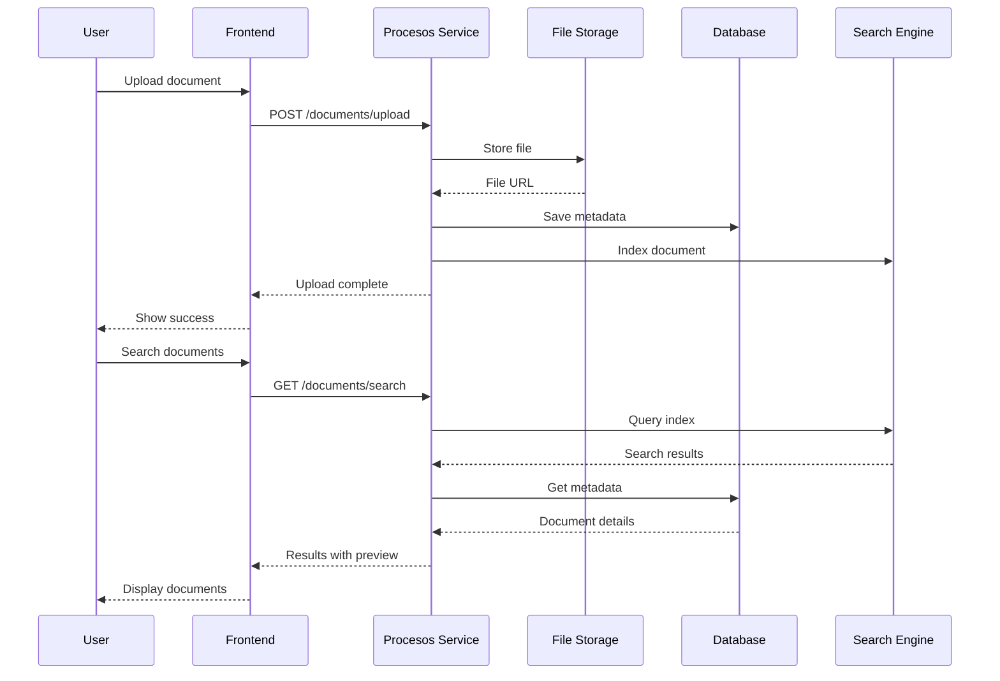

---

## 🔐 Seguridad

### Arquitectura de Seguridad

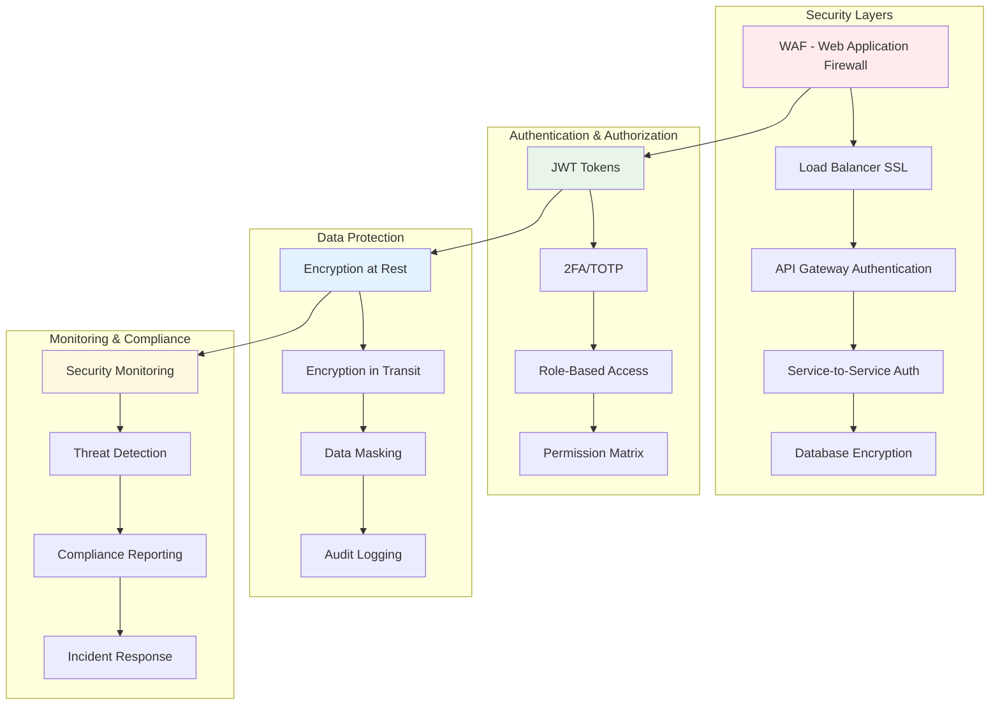

### Matriz de Permisos por Rol

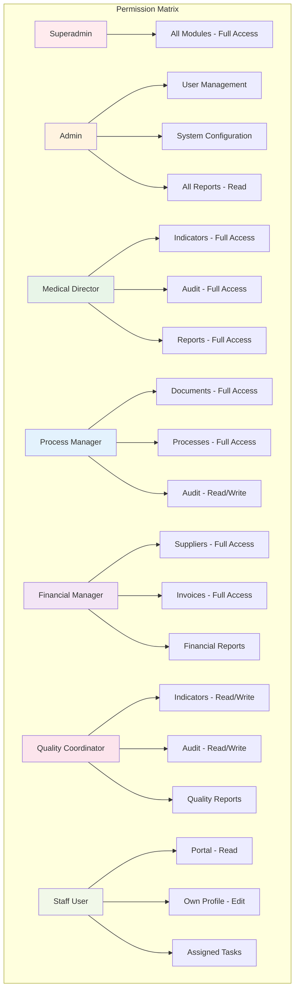

---

## 🚀 Despliegue

### Arquitectura de Despliegue

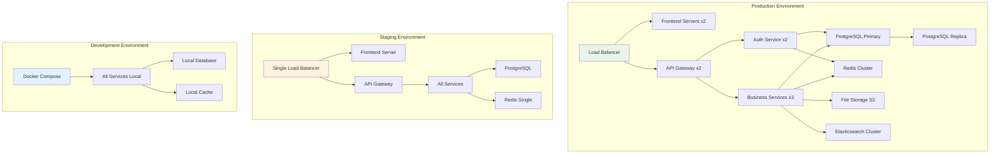

### Pipeline CI/CD

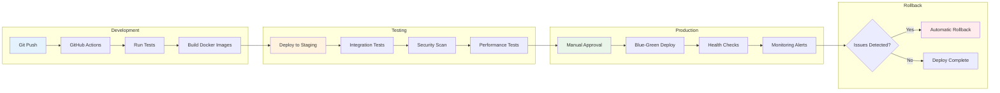

---

## 📈 Escalabilidad

### Estrategia de Escalado

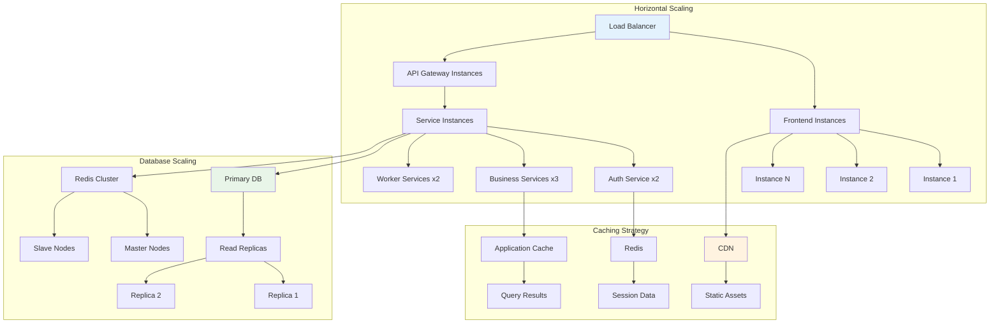

### Métricas de Performance

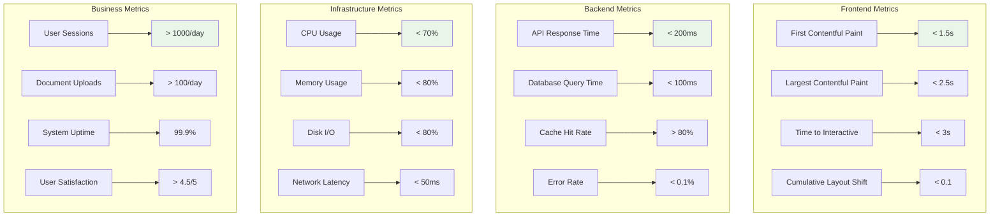

---

## 🛠️ Tecnologías y Stack Técnico

### Stack Completo

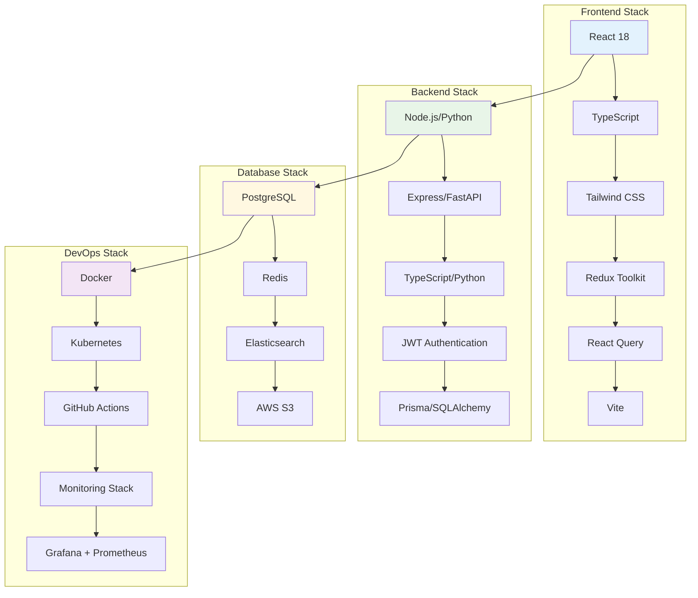

---

## 📊 Monitoreo y Observabilidad

### Arquitectura de Monitoreo

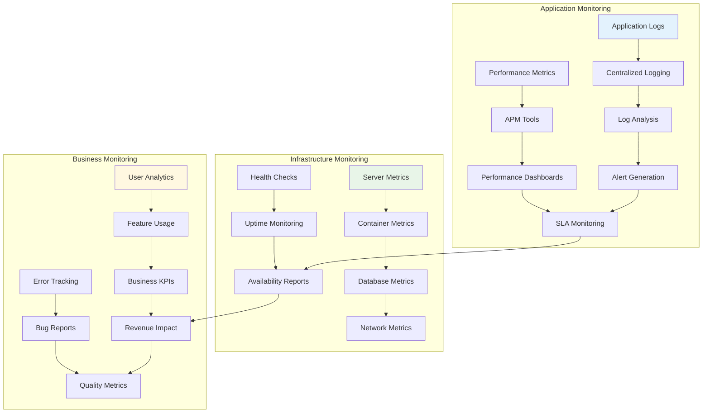

---

**Documento creado**: Octubre 2025  
**Versión**: 1.0  
**Última actualización**: Octubre 2025

Este documento de arquitectura debe mantenerse actualizado conforme el sistema evoluciona y se implementan nuevas funcionalidades.
