# Arquitectura del Sistema - Portal Web Backend

## Descripción General

Este documento describe la arquitectura completa del Portal Web Backend, incluyendo la estructura de componentes, flujo de datos, patrones de diseño y diagramas técnicos. El sistema está construido con Django siguiendo principios de arquitectura limpia y patrones de microservicios modulares.

---

## 📐 Arquitectura de Alto Nivel

### Diagrama de Arquitectura General

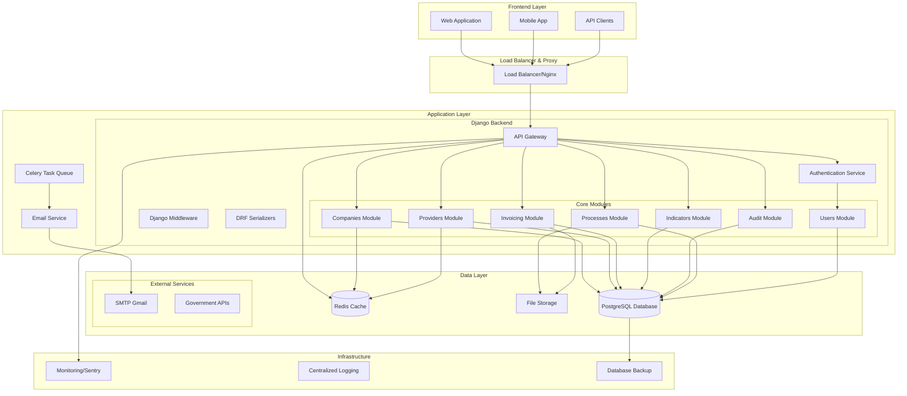

---

## 🏗️ Arquitectura de Capas

### Diagrama de Capas del Sistema

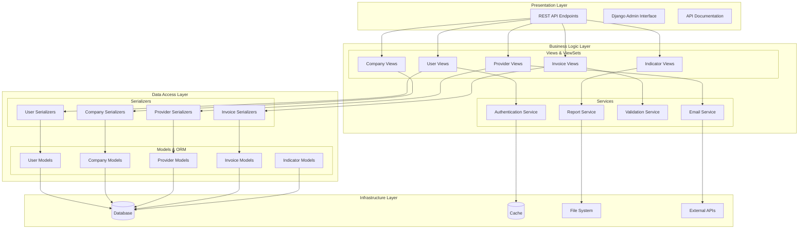

---

## 💾 Modelo de Datos

### Diagrama de Entidad-Relación Principal

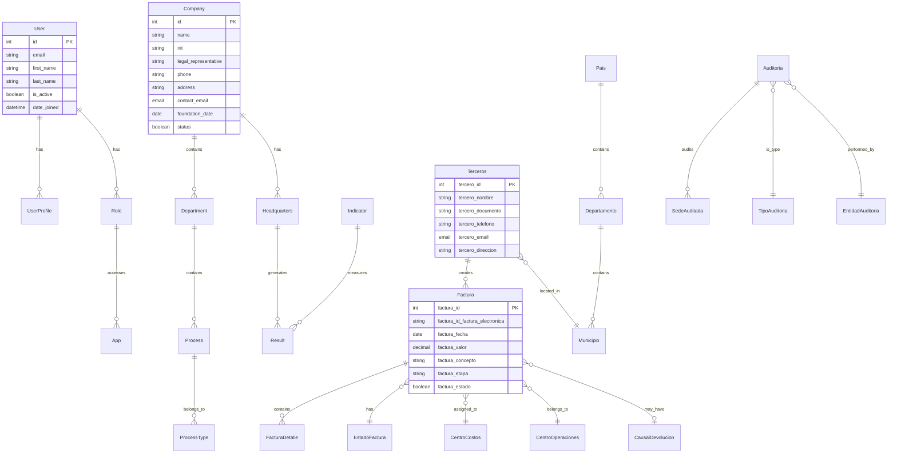

---

## 🔄 Flujo de Procesos de Negocio

### Flujo de Gestión de Facturas Electrónicas

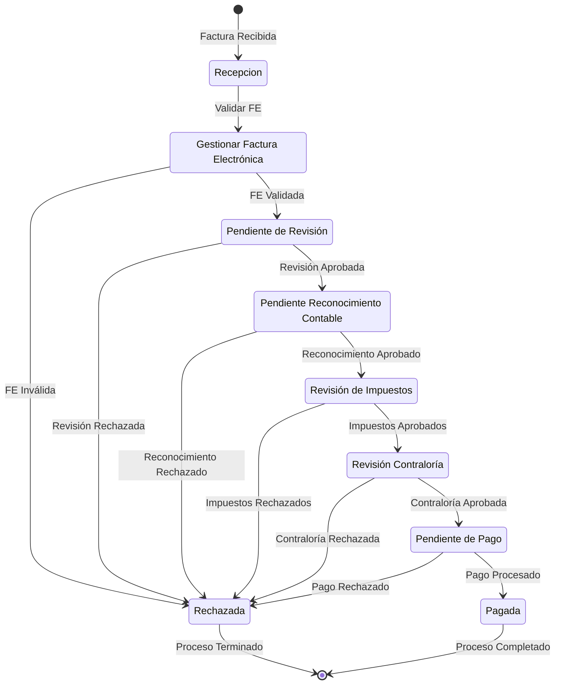

### Flujo de Autenticación con 2FA

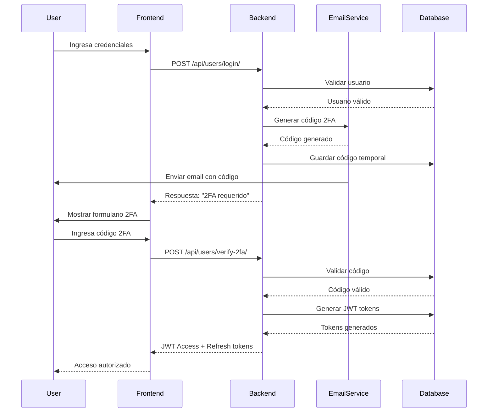

---

## 🔧 Arquitectura de Módulos

### Diagrama de Módulos y Dependencias

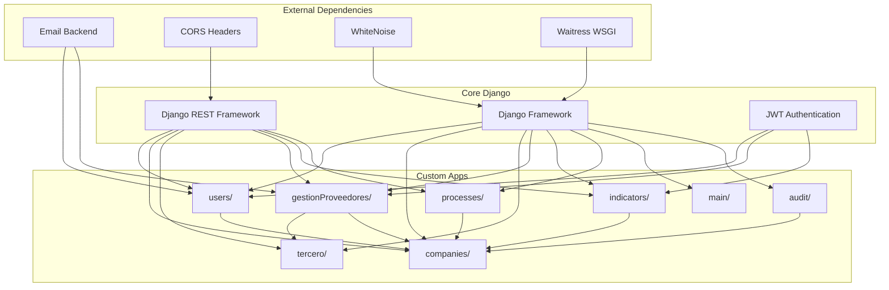

---

## 🌐 Arquitectura de Red y Deployment

### Diagrama de Infraestructura de Producción

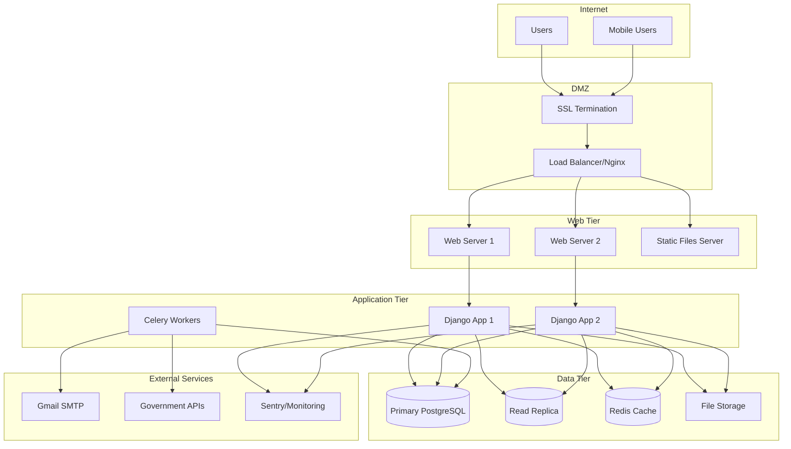

---

## 🔐 Arquitectura de Seguridad

### Diagrama de Seguridad y Autenticación

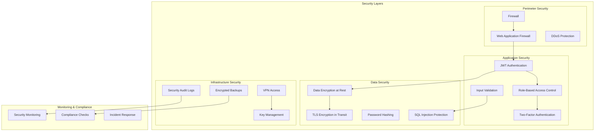

---

## 📊 Arquitectura de Datos

### Diagrama de Flujo de Datos

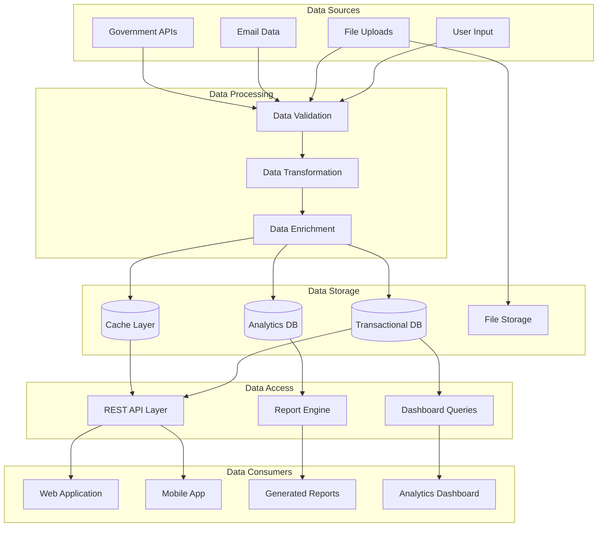

---

## 🚀 Patrones de Arquitectura Implementados

### 1. Model-View-Controller (MVC)
```python
# Django implementa MTV (Model-Template-View)
# Model: Django Models (ORM)
# View: Django Views/ViewSets
# Template: Frontend (React/Vue) separado
```

### 2. Repository Pattern
```python
# Implementado a través de Django ORM
# Managers personalizados actúan como repositories
class FacturaManager(models.Manager):
    def get_by_etapa(self, etapa):
        return self.filter(factura_etapa=etapa)
```

### 3. Service Layer Pattern
```python
# Servicios de negocio separados de las vistas
class EmailService:
    def send_2fa_code(self, user, code):
        # Lógica de envío de email
        pass
```

### 4. Serializer Pattern (DTO)
```python
# Django REST Framework Serializers
class FacturaSerializer(serializers.ModelSerializer):
    class Meta:
        model = Factura
        fields = '__all__'
```

---

## 📈 Escalabilidad y Performance

### Estrategias de Escalabilidad

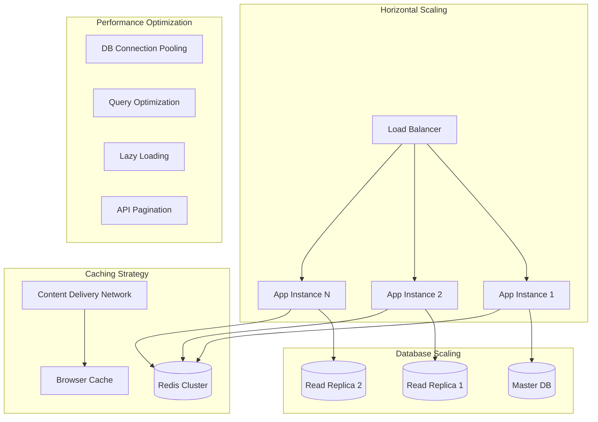

---

## 🔍 Monitoreo y Observabilidad

### Arquitectura de Monitoreo

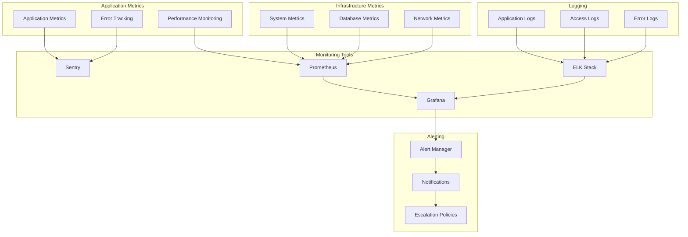

---

## 🛠️ Tecnologías y Herramientas

### Stack Tecnológico Completo

| Capa | Tecnología | Propósito |
|------|------------|-----------|
| **Backend Framework** | Django 5.2.2 | Framework web principal |
| **API Framework** | Django REST Framework | API REST |
| **Database** | PostgreSQL/SQLite | Base de datos relacional |
| **Cache** | Redis | Cache y sesiones |
| **Authentication** | JWT | Autenticación stateless |
| **Task Queue** | Celery | Tareas asíncronas |
| **Web Server** | Nginx + Waitress | Servidor web y WSGI |
| **Monitoring** | Sentry | Monitoreo de errores |
| **Documentation** | DRF-Spectacular | Documentación API |
| **Testing** | Pytest | Testing framework |
| **Code Quality** | Black, Flake8 | Formateo y linting |

### Configuración de Entornos

```python
# settings/base.py
INSTALLED_APPS = [
    'django.contrib.admin',
    'django.contrib.auth',
    'rest_framework',
    'rest_framework_simplejwt',
    'corsheaders',
    # Custom apps
    'users',
    'companies',
    'gestionProveedores',
    'tercero',
    'indicators',
    'processes',
    'main',
]

# settings/production.py
DATABASES = {
    'default': {
        'ENGINE': 'django.db.backends.postgresql',
        'OPTIONS': {
            'MAX_CONNS': 20,
            'conn_max_age': 600,
        }
    }
}

CACHES = {
    'default': {
        'BACKEND': 'django_redis.cache.RedisCache',
        'LOCATION': 'redis://127.0.0.1:6379/1',
    }
}
```

---

## 📋 Decisiones de Arquitectura

### Architecture Decision Records (ADR)

#### ADR-001: Elección de Django REST Framework
- **Fecha**: 2024-01-15
- **Estado**: Aceptado
- **Contexto**: Necesidad de crear API REST robusta
- **Decisión**: Usar Django REST Framework
- **Consecuencias**: 
  - ✅ Serialización automática
  - ✅ Autenticación integrada
  - ✅ Documentación automática
  - ❌ Curva de aprendizaje

#### ADR-002: Autenticación JWT vs Sessions
- **Fecha**: 2024-01-20
- **Estado**: Aceptado
- **Contexto**: API stateless para múltiples clientes
- **Decisión**: JWT con refresh tokens
- **Consecuencias**:
  - ✅ Escalabilidad horizontal
  - ✅ Soporte multi-cliente
  - ❌ Complejidad en invalidación

#### ADR-003: Estructura Modular de Apps
- **Fecha**: 2024-01-25
- **Estado**: Aceptado
- **Contexto**: Mantenibilidad y separación de responsabilidades
- **Decisión**: Apps Django por dominio de negocio
- **Consecuencias**:
  - ✅ Separación clara de responsabilidades
  - ✅ Reutilización de código
  - ✅ Testing independiente
  - ❌ Complejidad en relaciones entre apps

---

## 🔮 Roadmap de Arquitectura

### Fase 1: Consolidación (Q1 2025)
- [ ] Completar módulo de auditoría
- [ ] Implementar testing completo
- [ ] Optimizar consultas de base de datos
- [ ] Documentar APIs con OpenAPI

### Fase 2: Escalabilidad (Q2 2025)
- [ ] Migrar a PostgreSQL en producción
- [ ] Implementar Redis para caching
- [ ] Configurar Celery para tareas asíncronas
- [ ] Implementar monitoring con Sentry

### Fase 3: Optimización (Q3 2025)
- [ ] Implementar CDN para archivos estáticos
- [ ] Optimizar performance de APIs
- [ ] Implementar circuit breakers
- [ ] Configurar auto-scaling

### Fase 4: Avanzada (Q4 2025)
- [ ] Implementar Event Sourcing para auditoría
- [ ] Migrar a arquitectura de microservicios
- [ ] Implementar GraphQL API
- [ ] Machine Learning para predicciones

---

*Documento actualizado: Octubre 2025*  
*Próxima revisión: Enero 2026*