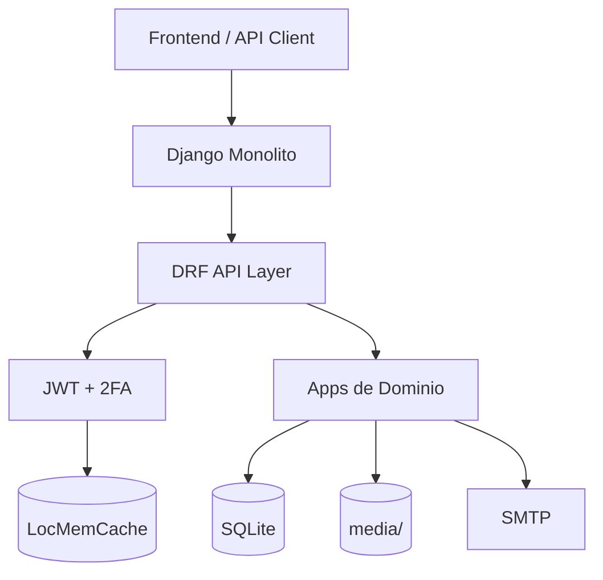
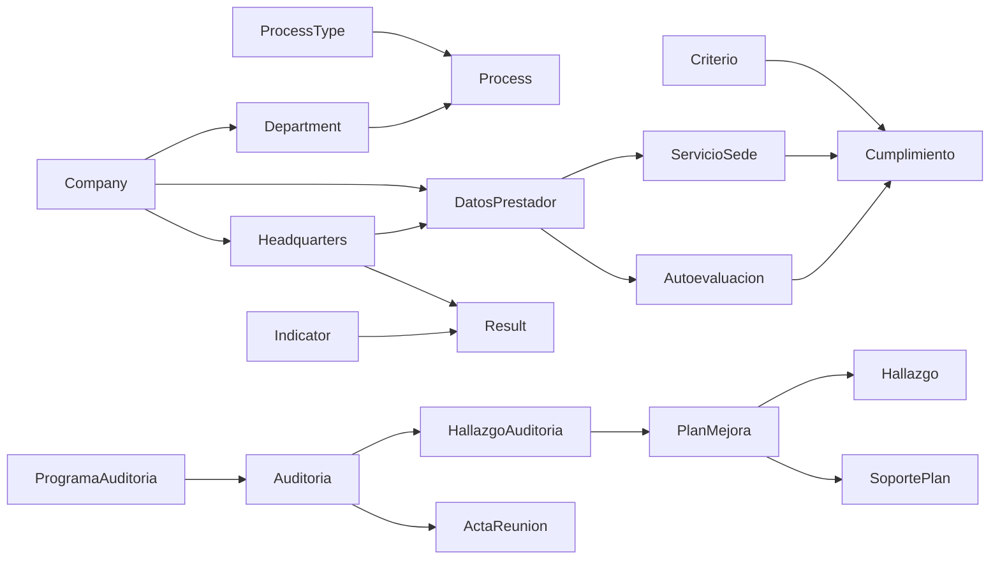
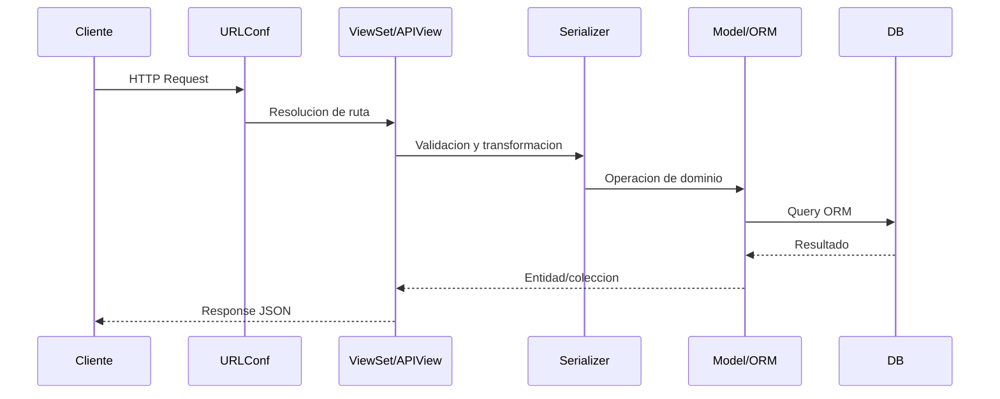

# Arquitectura del Sistema - Portal Web Backend

## Proposito del Documento

Este documento describe la arquitectura real implementada en el backend.
Esta pensado para onboarding tecnico, mantenimiento evolutivo, analisis de impactos y soporte operativo.

Alcance:

- Componentes reales en codigo
- Flujos tecnicos principales
- Relaciones entre apps
- Convenciones de implementacion
- Operacion local y despliegue
- Riesgos y deuda tecnica observable

No se documentan como "activos" componentes planeados que no esten implementados.

## 1. Contexto General

Portal Web Backend es una API REST construida con Django + DRF para soportar procesos de calidad y cumplimiento en organizaciones del sector salud.
El dominio esta dividido en modulos por responsabilidad de negocio:

- Gestion organizacional (`users`, `companies`, `main`)
- Gestion documental (`processes`, `soportes`)
- Cumplimiento normativo y habilitacion (`normativity`, `habilitacion`)
- Seguimiento de mejora y auditoria (`mejoras`, `audit`)
- Indicadores (`indicators`)

## 2. Estilo Arquitectonico

### 2.1 Tipo de arquitectura

- Monolito modular Django
- API REST en una sola aplicacion desplegable
- Separacion por apps de Django (bounded contexts ligeros)

### 2.2 Implicaciones del estilo

Ventajas actuales:

- Baja friccion para cambios transversales
- Desarrollo y depuracion local simples
- Reuso natural de modelo de datos entre modulos

Trade-offs:

- Acoplamiento entre apps por FK cruzadas
- Riesgo de crecimiento del monolito si no se controla frontera de modulos
- Cambios de alto impacto requieren pruebas de regresion mas amplias

## 3. Stack Tecnologico Verificado

Runtime y framework:

- Python 3.12.x (entorno local)
- Django 5.2.2
- Django REST Framework 3.16.0
- SimpleJWT 5.5.0

Infraestructura de aplicacion:

- WhiteNoise (estaticos)
- django-cors-headers
- django-filter
- Waitress (arranque alterno local)

Persistencia y cache:

- SQLite activo por defecto
- PostgreSQL disponible como configuracion alternativa (comentada)
- LocMemCache para cache temporal

Soporte funcional:

- SMTP Gmail para notificaciones por correo
- pyotp para 2FA

## 4. Vista de Componentes

```mermaid
graph TD
    FE[Frontend / API Client]
    DJ[Django Monolito]
    API[DRF API Layer]
    AUTH[JWT + 2FA]
    APPS[Apps de Dominio]
    DB[(SQLite)]
    CACHE[(LocMemCache)]
    MEDIA[(media/)]
    SMTP[SMTP]

    FE --> DJ
    DJ --> API
    API --> AUTH
    API --> APPS
    APPS --> DB
    AUTH --> CACHE
    APPS --> MEDIA
    APPS --> SMTP
```

## 5. Capas de la Aplicacion

### 5.1 Capa de entrada

- `backend/urls.py` centraliza prefijos
- Routers DRF por app en `*/urls.py`
- Endpoints APIView puntuales (principalmente en `users`)

### 5.2 Capa de API

- `ModelViewSet` como patron dominante de CRUD
- `@action` para operaciones de negocio no CRUD
- `serializers.py` para validacion/shape de payload
- Filtros con `django-filter`, busqueda y ordenamiento

### 5.3 Capa de dominio y datos

- Modelos Django ORM por app
- Relaciones FK/M2M entre modulos
- Managers y metodos de modelo para reglas especificas

### 5.4 Capa de infraestructura

- Configuracion central en `backend/settings.py`
- Static/media en filesystem
- Email backend SMTP
- Cache local en memoria

## 6. Enrutamiento y Superficie API

### 6.1 Endpoints globales

- `POST /api/token/`
- `POST /api/token/refresh/`
- `admin/`

### 6.2 Prefijos por modulo

- `/api/users/`
- `/api/companies/`
- `/api/processes/`
- `/api/main/`
- `/api/indicators/`
- `/api/normativity/`
- `/api/habilitacion/`
- `/api/soportes/`
- `/api/mejoras/`
- `/api/audit/`

Referencia de detalle por endpoint:

- `ENDPOINTS_API.md`

## 7. Mapa de Modulos

### 7.1 users

Responsabilidad:

- Autenticacion, roles, perfil actual, 2FA y password reset

Puntos tecnicos:

- Custom user model (`users.User`)
- Flujos de login con OTP temporal
- Endpoints de 2FA (`enable`, `verify`, `toggle`)

### 7.2 companies

Responsabilidad:

- Catalogo organizacional: empresas, sedes, procesos, regiones

Puntos tecnicos:

- Nucleo de referencias para otros modulos (`Headquarters`, `Process`)

### 7.3 processes

Responsabilidad:

- Gestion de documentos por proceso

Puntos tecnicos:

- Endpoints de `preview` y `download`
- Middleware custom vinculado a visualizacion embebida

### 7.4 main

Responsabilidad:

- Contenido transversal (funcionarios, eventos, felicitaciones, reconocimientos)

### 7.5 indicators

Responsabilidad:

- Indicadores y resultados

Puntos tecnicos:

- Endpoint `results/detailed` para agregados orientados a dashboard

### 7.6 normativity

Responsabilidad:

- Estandares, criterios y documentos normativos

Puntos tecnicos:

- Endpoints de consulta especializada (`mandatorios`, `con-evidencia`, etc.)

### 7.7 habilitacion

Responsabilidad:

- Prestadores, servicios, autoevaluaciones, cumplimientos y componentes complementarios

Puntos tecnicos:

- Subdominio mas amplio del sistema
- Integraciones directas con `normativity`, `processes`, `soportes`, `mejoras`
- Acciones de negocio para vencimientos, resumenes, validaciones y checklists

### 7.8 soportes

Responsabilidad:

- Catalogacion y almacenamiento de soportes documentales

### 7.9 mejoras

Responsabilidad:

- Planes de mejora y hallazgos con trazabilidad por origen

Puntos tecnicos:

- Origenes vinculables a habilitacion, auditoria e indicadores
- Manejo de soportes por plan

### 7.10 audit

Responsabilidad:

- Ciclo de auditorias, equipo auditor, hallazgos, actas y programas

Puntos tecnicos:

- Transicion de fase en auditorias
- Integracion con modulo `mejoras`

## 8. Relaciones de Datos (Vista de Ingenieria)

```mermaid
graph LR
    Company --> Headquarters
    Company --> Department
    Department --> Process
    ProcessType --> Process

    Headquarters --> DatosPrestador
    Company --> DatosPrestador
    DatosPrestador --> ServicioSede
    DatosPrestador --> Autoevaluacion
    Autoevaluacion --> Cumplimiento
    ServicioSede --> Cumplimiento
    Criterio --> Cumplimiento

    Indicator --> Result
    Headquarters --> Result

    Auditoria --> HallazgoAuditoria
    Auditoria --> ActaReunion
    ProgramaAuditoria --> Auditoria

    PlanMejora --> Hallazgo
    PlanMejora --> SoportePlan
    HallazgoAuditoria --> PlanMejora
```

## 9. Flujo de Request (Runtime)

```mermaid
sequenceDiagram
    participant C as Cliente
    participant U as URLConf
    participant V as ViewSet/APIView
    participant S as Serializer
    participant M as Model/ORM
    participant D as DB

    C->>U: HTTP Request
    U->>V: Resolucion de ruta
    V->>S: Validacion y transformacion
    S->>M: Operacion de dominio
    M->>D: Query ORM
    D-->>M: Resultado
    M-->>V: Entidad/coleccion
    V-->>C: Response JSON
```

## 10. Seguridad y Control de Acceso

Estado implementado:

- JWT como autenticacion por defecto en DRF
- 2FA disponible y operativo en modulo users
- CORS activo via middleware
- `CSRF_TRUSTED_ORIGINS` configurable por `FRONTEND_URL`
- `ALLOWED_HOSTS` acotado a localhost en configuracion actual

Observaciones:

- `DEBUG=True` en estado actual de settings
- Para despliegue productivo se requiere hardening explicito

## 11. Configuracion Operativa

### 11.1 Parametros relevantes

- `DJANGO_SECRET_KEY`
- `FRONTEND_URL`
- `EMAIL_HOST_USER`
- `EMAIL_HOST_PASSWORD`
- `EMAIL_PORT`
- `EMAIL_USE_TLS`

### 11.2 Recursos de filesystem

- `MEDIA_ROOT = media/`
- `STATIC_ROOT = staticfiles/`

### 11.3 Carga de datos

- `cargar_estandares.py`
- `python manage.py cargar_catalogo_soportes`

## 12. Deployment

### 12.1 Modo desarrollo

- `python manage.py runserver`

### 12.2 Ejecucion local tipo produccion

- `python run_waitress.py`

### 12.3 Escenario IIS

- Existe `web.config` en repositorio

## 13. Convenciones de Desarrollo

- Cada app expone su `urls.py` y `views.py`/`views/`
- Preferencia por ViewSets para CRUD
- Operaciones de negocio como `@action`
- Documentar endpoints nuevos en `ENDPOINTS_API.md`
- Mantener coherencia entre README, arquitectura y endpoints

## 14. Checklist para Nuevos Ingenieros

1. Levantar entorno virtual y dependencias
2. Revisar `backend/settings.py`
3. Ejecutar migraciones y cargas de catalogo
4. Revisar `backend/urls.py` y `ENDPOINTS_API.md`
5. Iniciar por modulo objetivo (models -> serializers -> views -> urls)
6. Ejecutar `python manage.py check` y pruebas relevantes por app

## 15. Riesgos Tecnicos Actuales

Riesgos visibles en el estado actual:

- Acoplamiento transversal alto por relaciones entre apps
- Posible crecimiento de complejidad del monolito
- `DEBUG=True` y configuracion local en settings base
- Cache local no distribuida
- Dependencia de SQLite para entorno por defecto

## 16. Hallazgos de Revision Estricta

Estos puntos estaban documentados como actuales en versiones anteriores y no correspondian al estado real:

- Arquitectura de microservicios
- Celery operando en background
- Redis como cache activa principal
- PostgreSQL activo por defecto
- Modulo de facturacion activo en apps/urls

## 17. Fuente de Verdad Tecnica

Validar siempre contra:

- `backend/settings.py`
- `backend/urls.py`
- `*/urls.py`
- `*/views.py` o `*/views/`
- `*/models.py` o `*/models/`
- `requirements.txt`
- `ENDPOINTS_API.md`

---

Documento de arquitectura tecnica orientado a uso real de ingenieria.
